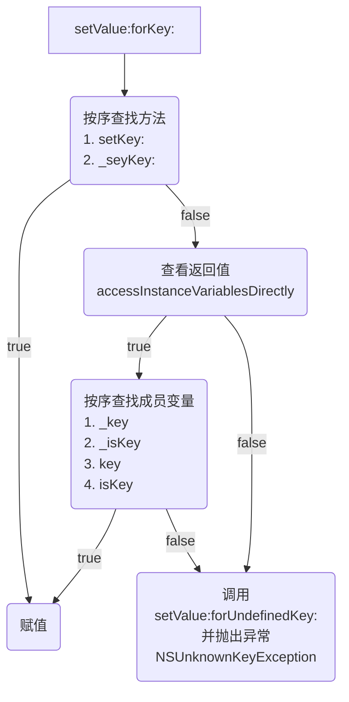
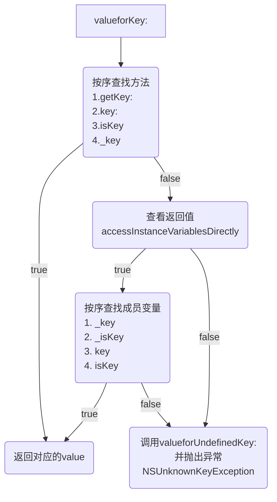

# 1. 基本使用
## 1.1 API说明
```
// 设值1
- (void)setValue:(nullable id)value forKey:(NSString *)key;
// 设值2
- (void)setValue:(nullable id)value forKeyPath:(NSString *)keyPath;
// 取值1
- (nullable id)valueForKey:(NSString *)key;
// 取值2
- (nullable id)valueForKeyPath:(NSString *)keyPath;
```

## 1.2 案例
```objc
@interface Student : NSObject
@property (assign, nonatomic) int age;
@end

@interface Teacher : NSObject
@property (assign, nonatomic) int age;
@property (assign, nonatomic) Student *student;
@end

Teacher *teacher = [[Teacher alloc] init];
// 设值
[teacher setValue:@28 forKey:@"age"];
[teacher setValue:@18 forKeyPath:@"student.age"];
// 取值
int teacherAge = [teacher valueForKey:@"age"];
int studentAge = [teacher valueForKey:@"student.age"];
```

## 1.3 KVC可触发KVO
1. <mark style="background: #BBFABBA6;">KVC</mark>内部调用了<mark style="background: #BBFABBA6;">setter</mark>方法
2. 即使对象没有实现<mark style="background: #BBFABBA6;">setter</mark>方法，<mark style="background: #BBFABBA6;">KVC</mark>底层也做了处理，也是通过<mark style="background: #BBFABBA6;">KVO</mark>的两个API触发
	1. `willChangeValueForKey`和`didChangeValueForKey`
	2. 中间的<mark style="background: #BBFABBA6;">setter</mark>方法可由KVC下的其他方式代替（<mark style="background: #BBFABBA6;">_setKey:、_key、_isKey、key、isKey</mark>）
3. 键值编码和键值监听，名字可看出

# 2. `setValue:forKey:`的原理


1. 按序查找方法<mark style="background: #BBFABBA6;">setKey、_setKey</mark>
	1. 找到赋值
	2. 找不到，调用`accessInstanceVariablesDirectly`查看是否有成员变量
		1. 返回<mark style="background: #BBFABBA6;">true</mark>，按序查找成员变量<mark style="background: #BBFABBA6;">_key、_isKey、key、isKey</mark>
			1. 找到赋值
			2. 找不到，调用方法`setValue:forUndefinedKey:`并抛出异常`NSUnknownKeyException`
		2. 返回<mark style="background: #BBFABBA6;">false</mark>，调用方法`setValue:forUndefinedKey:`并抛出异常`NSUnknownKeyException`


# 3. `valueForKey:`的原理 



1. 按序查找方法<mark style="background: #BBFABBA6;">getKey、key、isKey、_key</mark>
	1. 找到，返回对应的<mark style="background: #BBFABBA6;">value</mark>
	2. 找不到，调用`accessInstanceVariablesDirectly`查看是否有成员变量
		1. 返回true，按序查找成员变量<mark style="background: #BBFABBA6;">_key、_isKey、key、isKey</mark>
			1. 找到，返回对应的<mark style="background: #BBFABBA6;">value</mark>
			2. 找不到，调用方法`valueForUndefinedKey:`并抛出异常`NSUnknownKeyException`
		2. 返回false，调用方法`valueForUndefinedKey:`并抛出异常`NSUnknownKeyException`