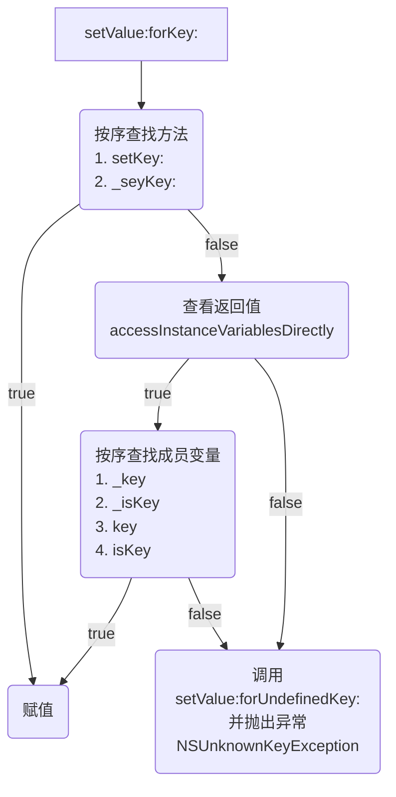

# 1. 基本使用
## 1.1 API说明
```
// 设值1
- (void)setValue:(nullable id)value forKey:(NSString *)key;
// 设值2
- (void)setValue:(nullable id)value forKeyPath:(NSString *)keyPath;
// 取值1
- (nullable id)valueForKey:(NSString *)key;
// 取值2
- (nullable id)valueForKeyPath:(NSString *)keyPath;
```

| 参数说明    |                           |
| ------- | ------------------------- |
| value   | id类型的值                    |
| key     |                           |
| keyPath | 如果有个属性是对象，要找该对象下的属性可调用该方法 |
## 1.2 案例
```objc
@interface Student : NSObject
@property (assign, nonatomic) int age;
@end

@interface Teacher : NSObject
@property (assign, nonatomic) int age;
@property (assign, nonatomic) Student *student;
@end

Teacher *teacher = [[Teacher alloc] init];
// 设值
[teacher setValue:@28 forKey:@"age"];
[teacher setValue:@18 forKeyPath:@"student.age"];
// 取值
int teacherAge = [teacher valueForKey:@"age"];
int studentAge = [teacher valueForKey:@"student.age"];
```

## 1.3 KVC可触发KVO
1. KVC内部调用了setter方法
2. 即使对象没有实现setter方法，KVC底层也做了处理，也是通过KVO的两个API触发
	1. `willChangeValueForKey`和`didChangeValueForKey`
	2. 中间的setter方法可由KVC下的其他方式代替（_setKey:、_key、_isKey、key、isKey）
3. 键值编码和键值监听，名字可看出

# 2. `setValue:forKey:`的原理



# 3. `valueForKey:`的原理 