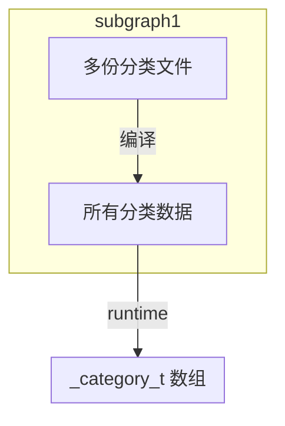

# 1. 基本使用
1. xcode创建分类文件
```objc
import "Person+Run.h"

@implementaition Person(Run)

- (void)slow {
	NSLog(@"slow");
}
```

# 2. 本质
 1. 分类的本质是结构体
 2. 程序编译时通过运行时将该结构体合并到类中
## 2.1 底层结构
```objc
struct _category_t {
	/// 类名
	const char *name;
	/// 类
	classref_t cls;
	/// 对象方法列表
	struct method_list_t *instanceMethods;
	/// 类方法列表
	struct method_list_t *classMethods;
	/// 协议列表
	struct protocol_list_t *protocols;
	/// 属性列表
	struct property_list_t *instanceProperties;
	/// 类属性
	struct property_list_t *_classProperties;

	/// 取出分类中的对象方法或类方法
	/// isMeta 是否是元类
	method_list_t *methodsForMeta(bool isMeta) {
		if (isMeta) return classMethods;
		else return instanceMethods;
	}
	
	property_list_t *propertiesForMeta(bool isMeta, struct header_info *hi);
};
```

## 2.2 加载过程

